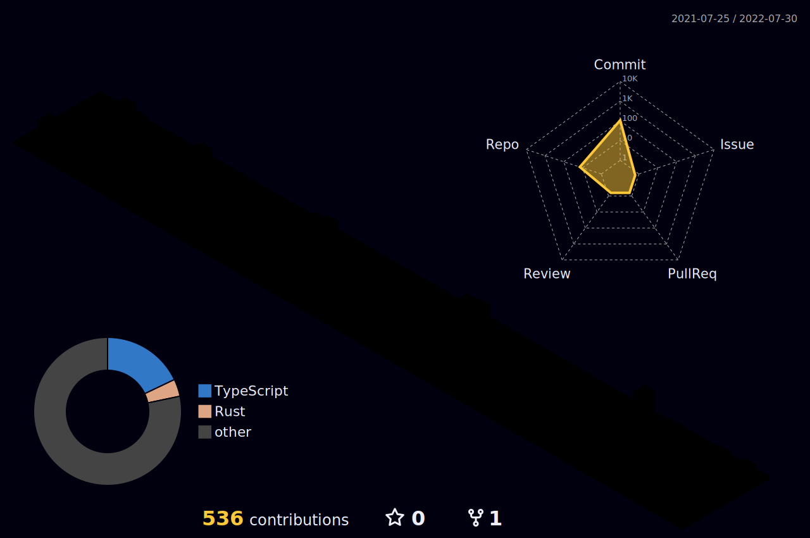

<h1>
  

    
      
          Lukas Kelley
     
      BlockChain Developer
  
   
</h1>

                                                                                                   

  <h2>🛠Languages and Tools :</h2>

  &nbsp;
  &nbsp;
  &nbsp;
  &nbsp;
  &nbsp;
  &nbsp;
  &nbsp;
  &nbsp;
  &nbsp;
  &nbsp;
  &nbsp;
  &nbsp;
  &nbsp;
  &nbsp;
  &nbsp;
  

<h2>📊 GitHub Stats </h2>

